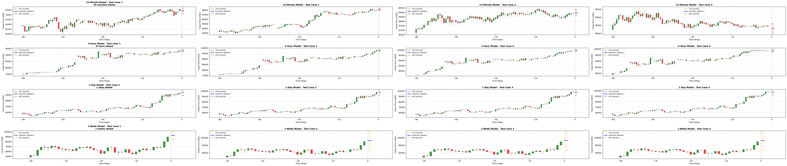
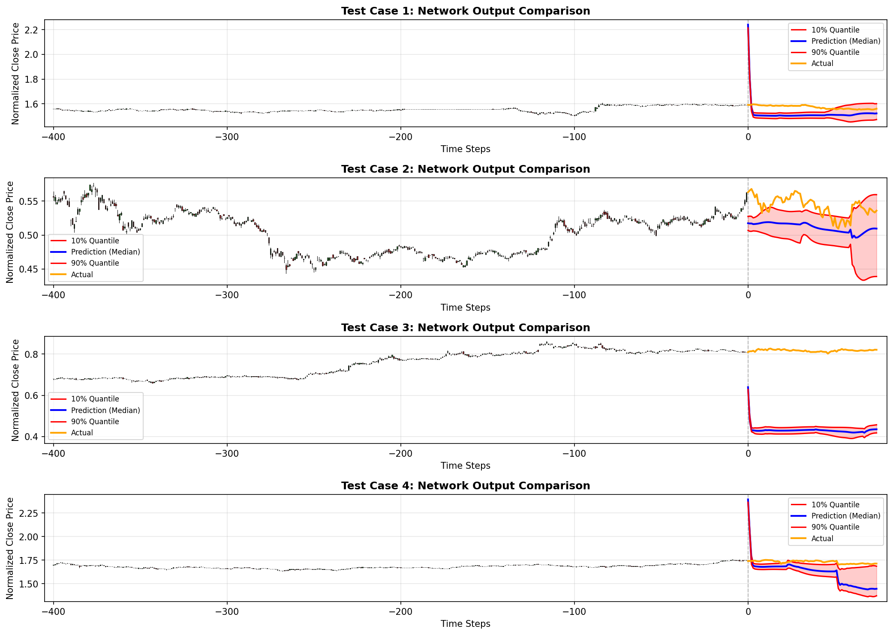
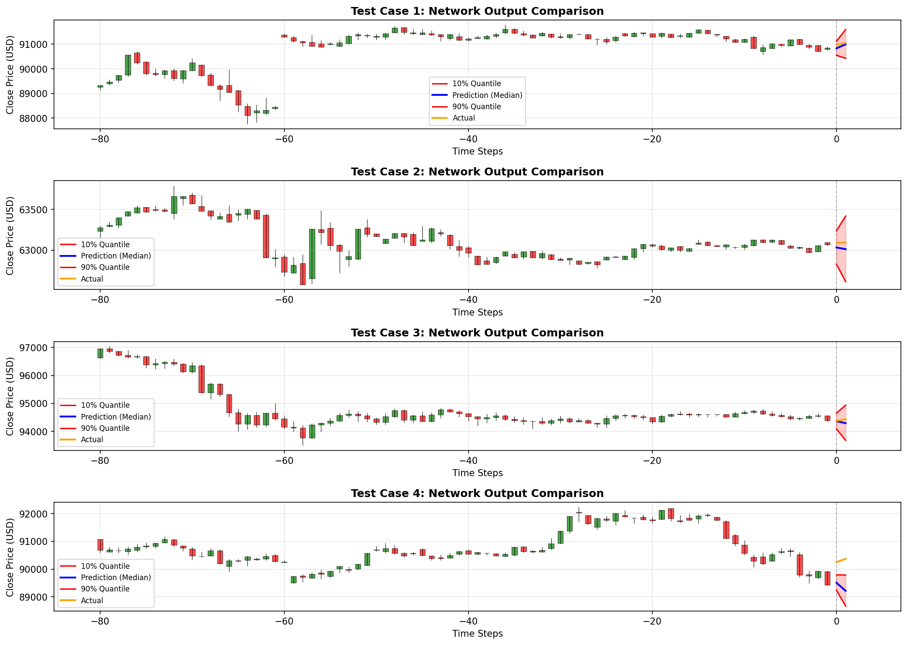
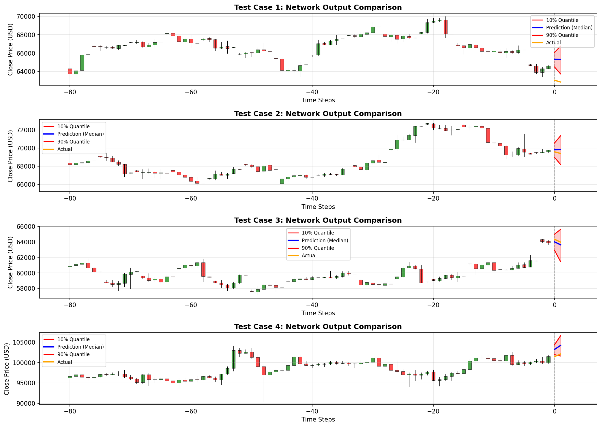
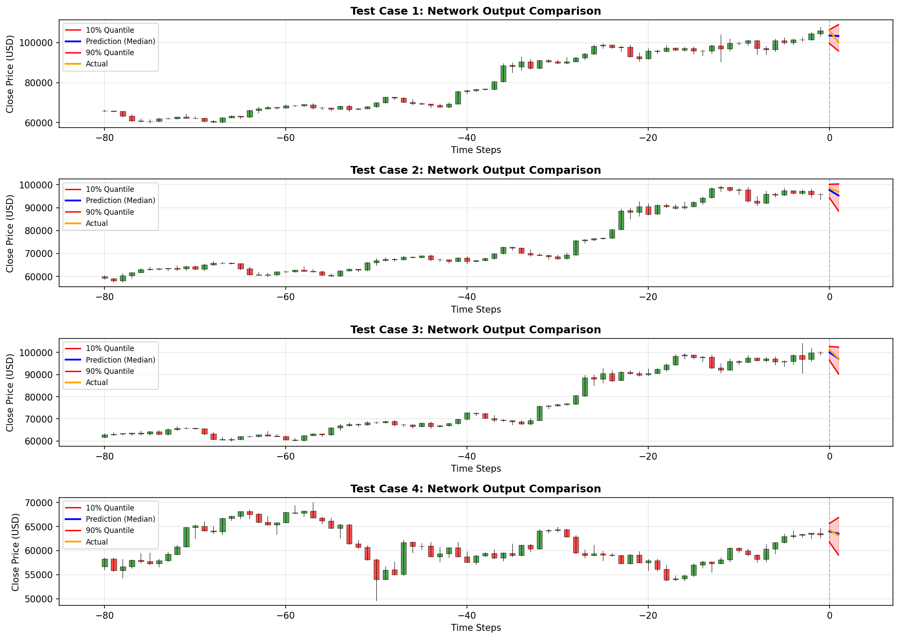
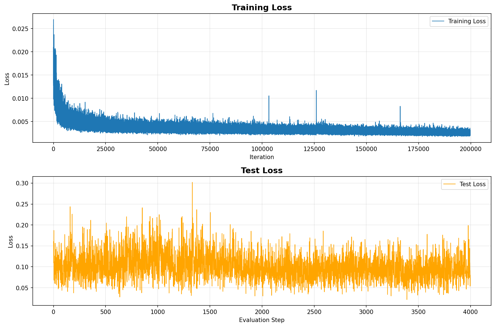
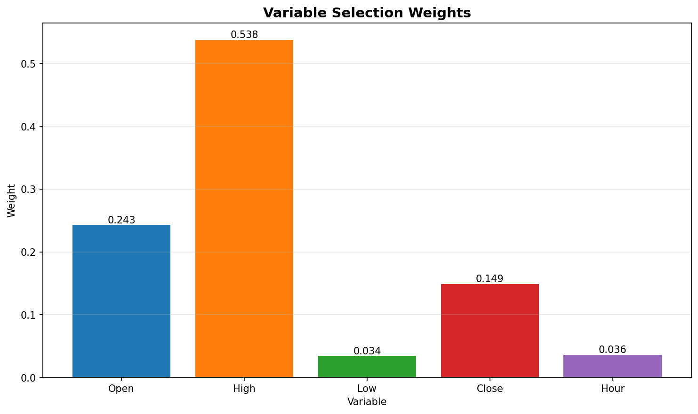

# BTC/USDT Multi-Timeframe TFT

Production-style research pipeline for BTC/USDT forecasting with Temporal Fusion Transformer (TFT), supporting:
- individual timeframe inference (`15min`, `4hr`, `1day`, `1week`)
- ensemble inference across all configured timeframes
- adapters for FutureView- and MPC-style downstream consumers

## Inference Preview


## Training and Evaluation Plots








## Portfolio Scope
This public repository is intentionally lightweight and privacy-safe:
- includes source code, experiment configuration, and inference/training wrappers
- excludes private datasets, heavy logs, and model checkpoints by default
- can be used by the public to train and run inference after adding data/checkpoints

## Repository Layout
- `scripts/inference_pipeline.py`: core multi-timeframe predictor
- `scripts/infer_cli.py`: public CLI for individual or ensemble inference
- `scripts/train_timeframe.py`: wrapper for timeframe-specific training scripts
- `scripts/futureview_adapter.py`: maps ensemble output to FutureView-style schema
- `scripts/mpc_adapter.py`: maps ensemble output to MPC vectors
- `experiments/experiment_*_op_v3/`: timeframe-specific feature engineering and training entrypoints
- `docs/PUBLIC_USAGE.md`: operational usage and troubleshooting

## Setup
```bash
python -m venv .venv
source .venv/bin/activate
pip install -r requirements.txt
```

## Required Inputs Before Inference
1. Per timeframe, checkpoint + stats must exist:
   - `experiments/experiment_<tf>_op_v3/models/model_200000.pt`
   - `experiments/experiment_<tf>_op_v3/norm_stats.json`
   - `experiments/experiment_<tf>_op_v3/feature_engineering.py`
2. A 1-minute BTC/USDT CSV must be provided via:
   - default path expected by `inference_pipeline.py`, or
   - `--raw-data-path` in CLI commands

## Inference
Individual timeframe:
```bash
python scripts/infer_cli.py \
  --timestamp "2024-11-20 12:00:00" \
  --mode individual \
  --timeframe 4hr \
  --raw-data-path /absolute/path/to/btc_1min.csv
```

Ensemble + adapters:
```bash
python scripts/infer_cli.py \
  --timestamp "2024-11-20 12:00:00" \
  --mode ensemble \
  --include-futureview \
  --include-mpc \
  --raw-data-path /absolute/path/to/btc_1min.csv \
  --output inference_output.json
```

## Train Further
Run one timeframe:
```bash
python scripts/train_timeframe.py --timeframe 15min
```

Run all timeframes:
```bash
python scripts/train_timeframe.py --all
```

## Security and Publishing Notes
- Keep raw data and checkpoints out of git unless intentionally publishing reproducibility artifacts.
- Keep `.env`, logs, and local outputs untracked.
- Re-run secret/path scans before any public push.
- Use `docs/SECURITY_CHECKLIST.md` as the pre-push checklist.
